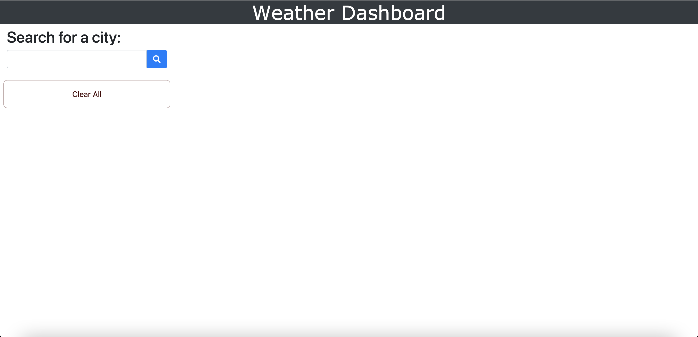
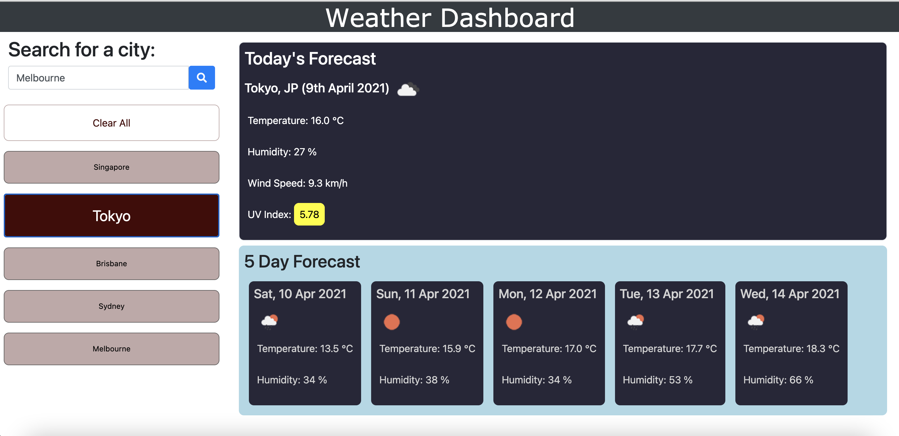
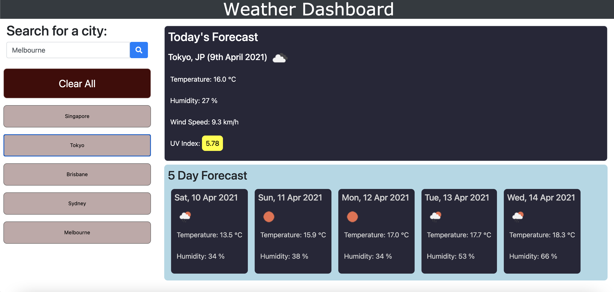

# 06 Server-Side APIs: Weather Dashboard
Project Owner: Aaron Au Yoong
 
View live link here: https://aaronauyoong.github.io/weather-dashboard/.

## Introduction
In order for travel enthusiasts to better plan their trips, they have the need to know weather outlooks for multiple cities. The creation of a weather dashboard would be ideal in order to meet their needs. 

## Technologies
This weather dashboard will run in the browser, feature dynamically updated HTML and CSS, and retrieve data from [OpenWeather API](https://openweathermap.org/api) to retrieve weather data for cities. For persistent data, localStorage will be used. 

## Functionalities
This weather dashboard comes with a built-in form input, allowing users to key in their desired city to search. Searching a city presents users with current and forecasted weather conditions. Current conditions include city name, country code, date, icon representing current weather conditions, current temperature (°C), current humidity, current wind speed (km/h) and current UV index. The UV index risk severity levels are as follows:

- Green = Low (0-2)
- Yellow = Moderate (3-5)
- Orange = High (6-7)
- Red = Very High (8-10)
- Purple = Extreme (11+)

Below the current weather conditions, are a five-day forecast displaying the date, an icon representation of weather conditions, the temperature, and the humidity.

Clicking on a city in the search history will present you with current and future conditions for that city. Search history is stored in localStorage. 

A clear all button allows for the user to clear their search history (and their localStorage), also causing the page to refresh, looking brand new.

The following image shows a mock-up of what is expected from this weather dashboard application: 
 

## Screenshots

1. Screenshot of landing page,  displaying current time and past timeblocks (grey).
 

 
 

2. Screenshot of first search of city "Tokyo", displaying current weather and forecasted weather.
 

 
 

3. Screenshot of second search of city "Los Angeles", displaying its current weather and forecasted weather. 
 

 
 

4. Screenshot of clicking on search history, bringing up the weather forecase of previous search.
 

 
 

5. Screenshot of hovering over the "Clear All" button.
 

 
 

6. Screenshot of after clicking the "Clear All" button, effectively clearing out the localStorage and refreshing the page.
 

 
 
